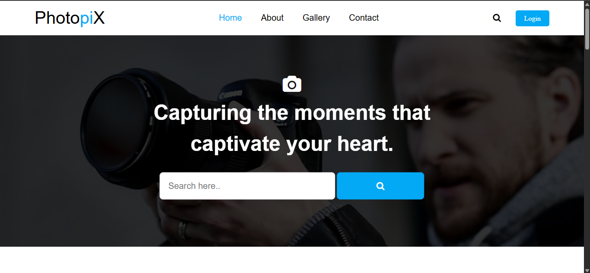
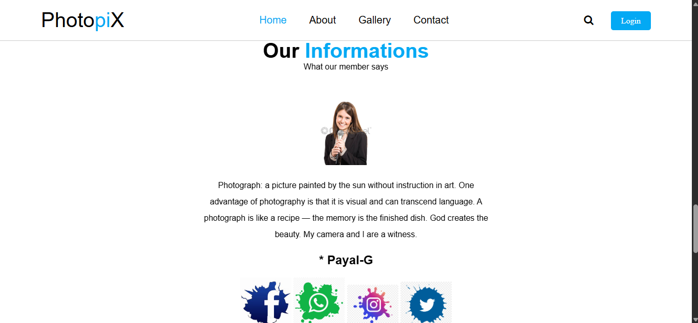
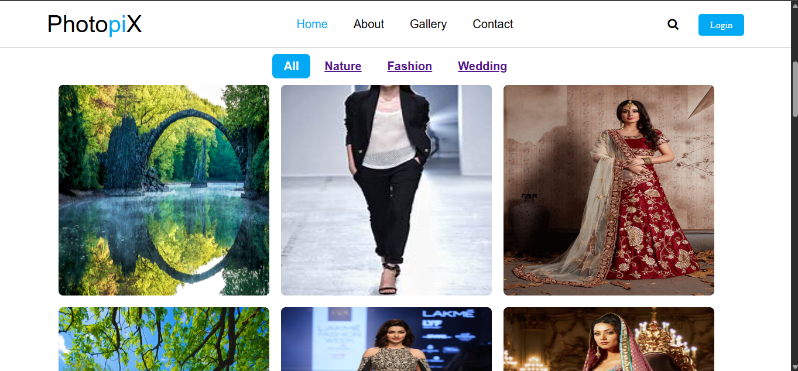
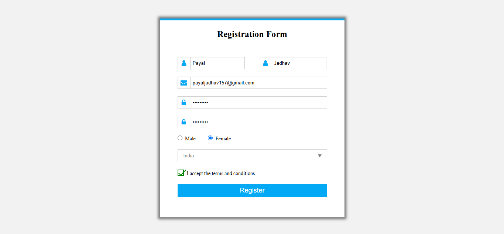
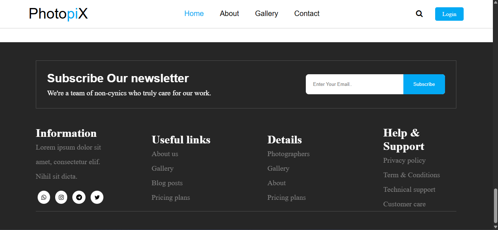

<div align="center">

# ✨ StyleSphere

### A Modern Photography & Fashion Showcase Website

Discover, explore, and showcase stunning photography collections through an elegant and responsive web experience.


</div>

---

## 📖 Overview

StyleSphere is a modern and responsive photography showcase website designed to provide an engaging visual experience for users interested in fashion, wedding, and nature photography.

The project demonstrates front-end web development concepts including responsive layouts, image gallery filtering, interactive user interfaces, animations, and form design. It combines elegant styling with user-friendly navigation to create a seamless browsing experience across devices.

---

## 🌟 Key Features

### 🏠 Home Page
- Responsive navigation bar
- Modern hero section
- Search interface
- Featured photography collections
- Smooth scrolling effects

### 🖼️ Interactive Gallery
- Dynamic image gallery
- Category-based image filtering
- Fashion photography collection
- Wedding photography collection
- Nature photography collection

### 👤 Registration Form
- User-friendly registration interface
- Email input fields
- Password fields
- Gender selection
- Country selection
- Form validation structure

### 🎨 User Experience
- Fully responsive design
- Smooth animations using AOS
- Interactive hover effects
- Font Awesome icons
- Clean and modern UI design

---

## 🚀 Demo

### Run Locally

Clone the repository:

```bash
git clone https://github.com/Payal2805/StyleSphere.git
```

Navigate to the project directory:

```bash
cd StyleSphere
```

Open the main page:

```bash
Photo web/Photo.html
```

No additional installation or dependencies are required.

---

## 🛠️ Tech Stack

| Technology | Purpose |
|------------|----------|
| HTML5 | Website Structure |
| CSS3 | Styling & Layout |
| JavaScript | Interactive Features |
| jQuery | DOM Manipulation |
| Font Awesome | Icons |
| AOS | Scroll Animations |

---

## 📂 Project Structure

```text
StyleSphere
│
├── Photo web
│   ├── Photo.html
│   ├── Gallery.html
│   ├── Registration_form.html
│   ├── style.css
│   ├── style1.css
│   ├── style2.css
│   └── images/
│
├── Register Form
│   ├── Form.html
│   └── images.jpg
│
└── README.md
```

---

## 📸 Gallery Categories

The website showcases photography collections in multiple categories:

### 🌿 Nature Photography
Beautiful landscapes, wildlife, and outdoor photography.

### 👗 Fashion Photography
Creative fashion shoots and modern style collections.

### 💍 Wedding Photography
Memorable wedding moments and professional wedding photography.

---

## 📱 Responsive Design

The website is optimized for:

- Desktop Computers
- Laptops
- Tablets
- Mobile Devices

Responsive layouts ensure a consistent user experience across all screen sizes.

---

## 🎯 Learning Outcomes

This project demonstrates practical knowledge of:

- Front-End Web Development
- Responsive Web Design
- HTML5 Semantic Structure
- CSS Styling Techniques
- JavaScript Fundamentals
- jQuery-Based Filtering
- UI/UX Design Principles
- Animation Libraries Integration

---

## 📷 Screenshots

### 🏠 Home Page



### ℹ️ About Page




### 🖼️ Gallery Page



### 👤 Registration Page



### 📞 Contact Page




---

## 🔮 Future Enhancements

- User Authentication System
- Login & Registration Backend
- Database Integration
- Image Upload Functionality
- Search Feature
- Dark Mode
- User Profiles
- Admin Dashboard
- Cloud Storage Integration
- Photography Booking System

---

## 🤝 Contributing

Contributions are welcome.

### Steps to Contribute

1. Fork the repository

2. Create your feature branch

```bash
git checkout -b feature/amazing-feature
```

3. Commit your changes

```bash
git commit -m "Add amazing feature"
```

4. Push to the branch

```bash
git push origin feature/amazing-feature
```

5. Open a Pull Request

---

## 👩‍💻 Author

**PAYAL JADHAV**


🔗 GitHub: https://github.com/Payal2805

📧 Email: payaljadhav157@gmail.com

---

## ⭐ Show Your Support

If you found this project useful, please consider giving it a ⭐ on GitHub.

Your support helps motivate future improvements and new projects.

---

## 📜 License

This project is licensed under the MIT License.

Feel free to use, modify, and distribute this project for educational and personal purposes.

---

<div align="center">

### ✨ Crafted with Passion for Photography & Web Design ✨


</div>
